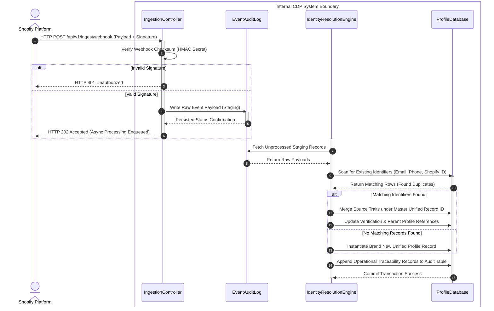

---

## 3. Sequence Diagrams

### 3.1 Real-Time Ingestion & Identity Resolution Pipeline (UC-04 & UC-06)
This sequence diagram illustrates the step-by-step temporal interaction between Shopify, the API Ingestion Controller, the Identity Resolution Service, and the persistent datastore when an incoming webhook is received.


### 3.2 Segment Evaluation Workflow (UC-07)
This sequence diagram illustrates how saved rules are loaded, compiled into analytical database queries, and executed to refresh segment membership mapping records.

```mermaid
sequenceDiagram
    autonumber
    actor Caller as Data Analyst / Automation Cron
    box Internal CDP System Boundary
        participant Ctrl as SegmentController
        participant Engine as SegmentationEngine
        participant DB as ProfileDatabase
    end

    Caller ->> Ctrl: POST /api/v1/segments/{segmentId}/refresh
    activate Ctrl
    
    Ctrl ->> Engine: Trigger Evaluation Request (SegmentID)
    activate Engine
    
    Engine ->> DB: Fetch Saved Segment Rules & Metadata
    activate DB
    DB -->> Engine: Return Rule AST/Conditions (e.g., total_spent > 500)
    
    Engine ->> Engine: Compile Rules into Optimized Database Query String
    
    Engine ->> DB: Execute Dynamic Segment Query Against Active Profiles
    DB -->> Engine: Return List of Matching Unified Customer IDs
    
    Engine ->> DB: Flush Old Roster & Batch Insert New Customer ID Mappings
    DB -->> Engine: Confirm Transaction Commit (Success)
    deactivate DB
    
    Engine -->> Ctrl: Return Total Membership Count & Execution Metrics
    deactivate Engine
    
    Ctrl -->> Caller: Return HTTP 200 OK (JSON Summary Map)
    deactivate Ctrl
